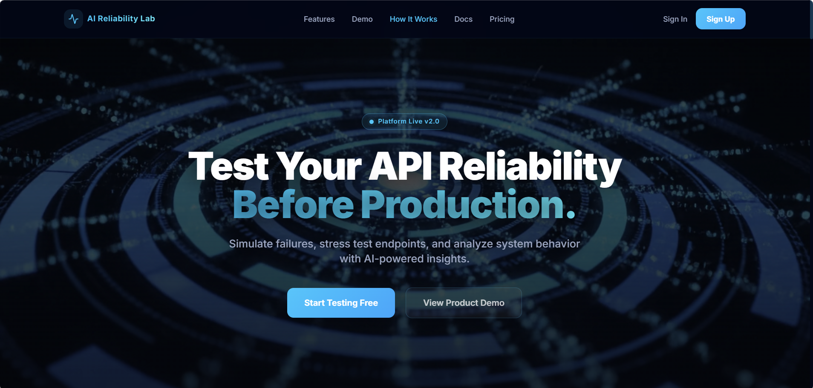

# ⚡ AI Reliability Lab


> *Note: Please save the provided screenshot as `hero.png` inside your `public/` folder so it appears here!*

## 📖 The Problem
APIs break, latency spikes, and debugging in production is chaotic. Most developers only discover system bottlenecks or timeout failures *after* their customers complain. Finding out how your system behaves under stress shouldn't require a catastrophic outage.

## 💡 My Solution
**AI Reliability Lab** is a full-stack SaaS platform designed to safely simulate API failures and stress-test endpoints before they reach production. It actively probes your endpoints, streams real-time latency metrics, and leverages AI to provide structured, actionable insights on how to improve your system's resilience.

## 🏗️ Architecture Explanation
The platform is built on modern serverless architecture:
- **Frontend & Backend:** Next.js 14 App Router unifies the React frontend and server-side API Route Handlers.
- **Real-Time Streaming:** Server-Sent Events (SSE) stream simulation logs and live latency charts directly to the dashboard without heavy WebSocket server requirements.
- **Data Layer:** Prisma ORM manages relationship schemas for multi-tenant users, subscriptions, and historical simulation data inside PostgreSQL.
- **Caching & Observability:** Redis acts as a high-speed caching layer and system health probe, minimizing database reads for frequent queries.

## 🛠️ Tech Stack
- **Framework:** Next.js 14, React 18, TypeScript
- **Database:** PostgreSQL, Prisma ORM
- **Cache / Performance:** Redis (Upstash & ioredis)
- **Authentication:** NextAuth.js (Credentials + JWT)
- **Styling:** Tailwind CSS, Framer Motion
- **Integrations:** OpenAI SDK, Resend (Emails), Razorpay (Payments), Sentry (Observability)

## 🧗‍♂️ Challenges Overcome
1. **Real-Time Delivery:** Sending live latency test results to the frontend without hanging normal HTTP requests. Solved by implementing native Next.js Server-Sent Events (SSE).
2. **Predictable AI Outputs:** LLMs often return messy text. Solved by strictly enforcing `zod` schemas through the OpenAI SDK to return guaranteed JSON formats for risk levels and confidence scores.
3. **Database Performance:** Fetching historical latency graphs was causing full table scans. Solved by optimizing the Prisma schema with targeted `@@index` constraints for O(1) query lookups.

---

### Run Locally
```bash
# 1. Clone & Install
npm install

# 2. Setup Database
docker-compose up -d
npx prisma generate
npx prisma db push

# 3. Run Development Server
npm run dev
```