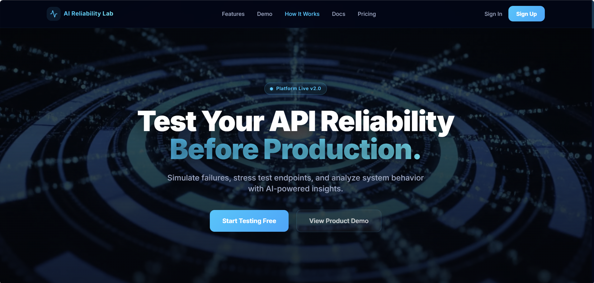

# ⚡ API Reliability Lab

**[🚀 Live demo](https://arp-cgpt.vercel.app/)**

<p align="center">
  
</p>

## What this project is (honest version)

**API Reliability Lab** is a full-stack SaaS demo that:

1. Lets you sign up and create projects
2. Probes a **public** HTTP(S) endpoint (real `GET` request)
3. Streams live progress into the dashboard with **Server-Sent Events (SSE)**
4. Saves run history in **PostgreSQL**
5. Returns **AI structured insights** (or a safe fallback if no OpenAI key)
6. Supports **API keys**, rate limits (Free 10/min · Pro 100/min), Redis cache, Docker, and CI

It does **not** inject artificial failures or ship a CLI. It **does** support small concurrent probes (1–20) with p50/p95/error % and GET/POST + custom headers.

## Why it exists

APIs get slow or break. This app is a portfolio-ready way to measure that early: probe → stream → store → explain with AI.

## Architecture (simple)

```
Browser (dashboard)
   │
   ├─ Next.js pages (marketing + login + dashboard)
   │
   └─ API routes
         ├─ Auth (NextAuth credentials + JWT)
         ├─ Projects (Postgres via Prisma)
         ├─ Simulate / SSE stream
         │     ├─ ownership check (your project only)
         │     ├─ SSRF URL safety (no localhost / private IPs)
         │     ├─ fetch public endpoint
         │     └─ AI analysis (Zod-shaped JSON)
         └─ Redis (optional cache + rate limits)
```

## Tech stack

- **Next.js 14** App Router, React 18, TypeScript
- **PostgreSQL** + **Prisma**
- **Redis** (Upstash REST and/or `REDIS_URL`)
- **NextAuth** (credentials + JWT)
- **Vercel AI SDK** + OpenAI (optional)
- **Razorpay** (optional Pro upgrade)
- **Resend**, **Sentry**, Docker, GitHub Actions

## Challenges I solved

1. **Live updates without WebSockets** — SSE streams probe progress on serverless-friendly hosting.
2. **Predictable AI JSON** — Zod schemas keep risk levels / insights structured.
3. **Security basics for a probe tool** — SSRF blocking + project ownership checks so users cannot hit private networks or write into someone else’s project.

## Run locally

```bash
# 1. Install
npm install

# 2. Env file
cp .env.example .env.local
# edit DATABASE_URL, NEXTAUTH_SECRET, NEXTAUTH_URL

# 3. Database (+ Redis optional)
docker-compose up -d
npx prisma generate
npx prisma db push

# 4. Dev server
npm run dev
```

Open [http://localhost:3000](http://localhost:3000) → Sign up → Dashboard → keep the default `https://httpbin.org/get` → Run.

### Useful scripts

| Command | What it does |
|---------|----------------|
| `npm run dev` | Local app |
| `npm run build` | Production build |
| `npm run test` | Unit tests (SSRF, ownership helper, auth helpers) |
| `npm run lint` | ESLint |

## Plans

| Plan | Access | Rate limit |
|------|--------|------------|
| Free | Full dashboard | 10 requests / minute |
| Pro | Same features | 100 requests / minute via verified Razorpay |

There is **no** fake “Pay Securely” unlock. `/api/upgrade` is disabled on purpose.

## Security notes for reviewers

- Endpoints must be `http`/`https` and resolve to public IPs
- Simulations require the `projectId` to belong to the current user
- Admin emails come from `ADMIN_EMAIL` / `ADMIN_EMAILS` or `User.isAdmin` in the DB — not hardcoded addresses
- API keys are **hashed** (SHA-256); the full key is shown only once at generation
- `middleware.ts` guards dashboard + private APIs; metrics require a session
